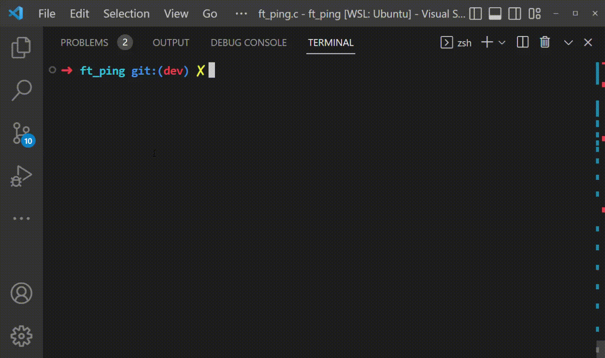

ft_ping
=======

| ./ft_ping [-cC] [-tT] [-vV]

DESCRIPTION
===========
Ping uses the ICMP protocol's mandatory ECHO_REQUEST datagram to elicit an ICMP ECHO_RESPONSE from a host or gateway. ECHO_REQUEST datagrams ("pings") have an IP and ICMP header, followed by a struct timeval and then an arbitrary number of “pad” bytes used to fill out the packet.

OPTIONS
-------
-T -t

: Set the IP Time to Live

-C -c

: Stop after sending count ECHO_REQUEST packets

-V -v

: Enable hex output like tcpdump

