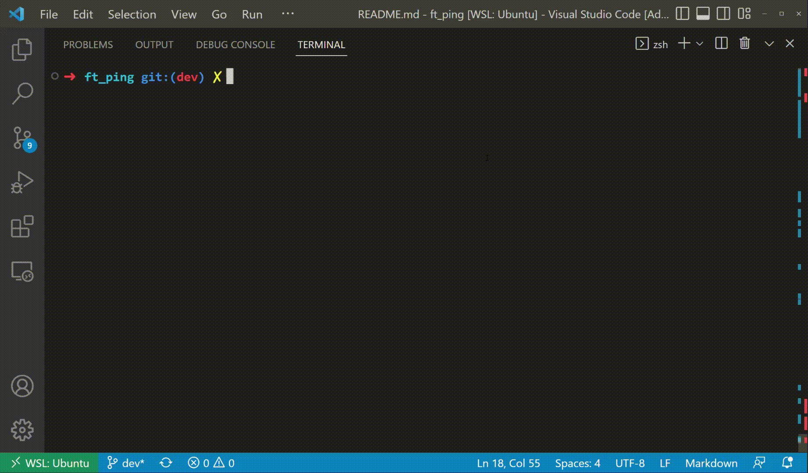
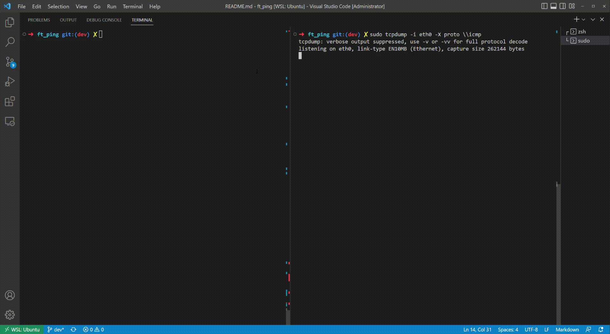

# ft_ping
### MAN DESCRIPTION
    ping uses the ICMP protocol's mandatory ECHO_REQUEST datagram to elicit an ICMP ECHO_RESPONSE from a host or gateway. ECHO_REQUEST datagrams (“pings”) have an IP and ICMP header, followed by a struct timeval and then an arbitrary number of “pad” bytes used to fill out the packet.

### This ping supports a few options:
    -T -t 
        Set the IP Time to Live
    -C -c 
        Stop after sending count ECHO_REQUEST packets
    -V -v
        Enable hex output like tcpdump

